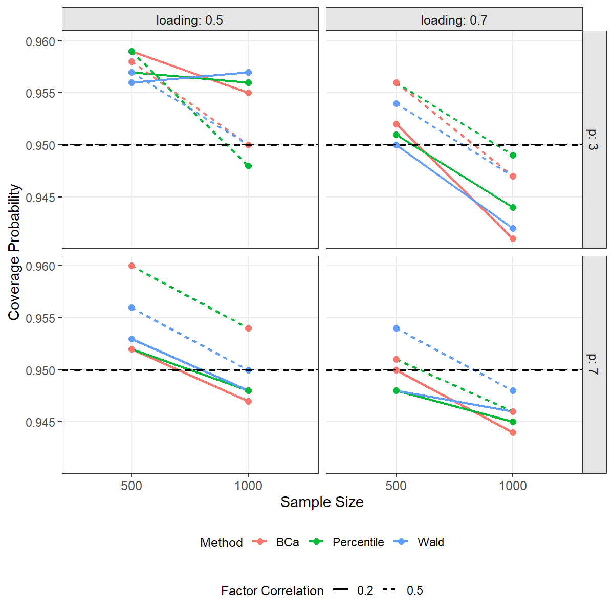

```{css style settings, echo = FALSE}
body {
  font-size: 18px;
  line-height: 1.7;
}

h1, h2, h3 {
  margin-top: 1.5em;
}

pre {
  border-radius: 8px;
  padding: 12px;
}
```

```{r setup, include=FALSE}
knitr::opts_chunk$set(echo = TRUE)
```

## Overview 

Simulation studies in structural equation modeling (SEM) can be computationally demanding. This tutorial explores practical strategies for running SEM simulations efficiently in high-performance computing (HPC) environments using the R package `simsem`. I was motivated by a simple question: *Is it faster to split jobs into chunks and run them separately, or to use the built-in `multicore` feature in `sim()`?* 

To answer this, I developed a new feature and compared it with the existing functionality in `simsem`. Since I had already conducted this comparison, I turned the results into this tutorial to demonstrate how to use `simsem` in HPC environments. I consider three approaches:

1. No parallelization (baseline)
2. Parallel computation via `multicore = TRUE` and `numProc`
3. Serialization using the new `repRun` feature (manual splitting)

As a quick preview, **parallel computation is more efficient than serialization and much easier to implement**. Later, I discuss a situation where serialization might still be useful. 

This tutorial demonstrates:

- How to implement each approach using SLURM + R
- How to ensure reproducibility across approaches
- An empirical comparison of computation time and service usage

This note focuses on how to run simulations efficiently in HPC, rather than on the simulation results themselves.

## Simple Illustration of Three Approaches

Let me start with a simple bootstrap example that I will later use for empirical illustration. Consider a two-factor model with seven items per factor, standardized loadings of .7, and a factor correlation of .5:

```{r singledatamodel}
generatescript <- '
f1 ~ 0.7*x1 + 0.7*x2 + 0.7*x3 + 0.7*x4 + 0.7*x5 + 0.7*x6 + 0.7*x7
f2 ~ 0.7*y1 + 0.7*y2 + 0.7*y3 + 0.7*y4 + 0.7*y5 + 0.7*y6 + 0.7*y7
f1 ~~ 0.5*fx
x1 ~~ 0.51*x1
x2 ~~ 0.51*x2
x3 ~~ 0.51*x3
x4 ~~ 0.51*x4
x5 ~~ 0.51*x5
x6 ~~ 0.51*x6
x7 ~~ 0.51*x7
y1 ~~ 0.51*y1
y2 ~~ 0.51*y2
y3 ~~ 0.51*y3
y4 ~~ 0.51*y4
y5 ~~ 0.51*y5
y6 ~~ 0.51*y6
y7 ~~ 0.51*y7
'
```

For illustration, I first generate a single dataset and compute the confidence intervals manually before moving to `simsem`. `set.seed(123321)` is used for data generation.

```{r singledatagen}
library(lavaan)
set.seed(123321)
dat <- simulateData(generatescript, sample.nobs=500)
```

Next, I analyze data using bootstrap (`se="boot"`). Note that `iseed = 787221` is specified so that the same bootstrap samples are drawn across runs.

```{r singleanalyzedat}
analyzescript <- '
f1 ~ x1 + x2 + x3 + x4 + x5 + x6 + x7
f2 ~ y1 + y2 + y3 + y4 + y5 + y6 + y7
f1 ~~ cov*fx
'
out <- cfa(analyzescript, data=dat, std.lv=TRUE, se="boot", iseed=787221)
out
```

I compare three types of confidence intervals (CI) with a confidence level of .95 and 1,000 bootstrap samples (the default in `lavaan`).

First, Wald CI is computed by using `vcov` to get variance of the factor correlation estimate, calculate standard error, and then the Wald CI.

```{r singlewaldci}
est <- coef(out)["cov"]
sewald <- sqrt(vcov(out)["cov", "cov"])
crit <- qnorm(1 - (1 - 0.95)/2)
waldlower <- est - crit*sewald
waldupper <- est + crit*sewald
c(waldlower, waldupper)
```

Second, percentile bootstrap CI

```{r singlepercci}
percout <- data.frame(parameterestimates(out, boot.ci.type = "perc", level=0.95))
perclower <- percout[percout$label == "cov", "ci.lower"]
percupper <- percout[percout$label == "cov", "ci.upper"]
c(perclower, percupper)
```

Third, bias-corrected bootstrap CI

```{r singlebcaci}
bcaout <- data.frame(parameterestimates(out, boot.ci.type = "bca.simple", 
                                        level=0.95))
bcalower <- bcaout[bcaout$label == "cov", "ci.lower"]
bcaupper <- bcaout[bcaout$label == "cov", "ci.upper"]
c(bcalower, bcaupper)
```

These three approaches will later be compared within the simulation framework. I then define a function to automatically obtain all types of CI, which will be used later in `simsem`.

```{r singleciextract}
ciextract <- function(out) {
  est <- coef(out)["cov"]
  sewald <- sqrt(vcov(out)["cov", "cov"])
  crit <- qnorm(1 - (1 - 0.95)/2)
  waldlower <- est - crit*sewald
  waldupper <- est + crit*sewald
  percout <- data.frame(parameterestimates(out, boot.ci.type = "perc", level=0.95))
  perclower <- percout[percout$label == "cov", "ci.lower"]
  percupper <- percout[percout$label == "cov", "ci.upper"]
  bcaout <- data.frame(parameterestimates(out, boot.ci.type = "bca.simple", level=0.95))
  bcalower <- bcaout[bcaout$label == "cov", "ci.lower"]
  bcaupper <- bcaout[bcaout$label == "cov", "ci.upper"]
  c(waldlower=waldlower, waldupper=waldupper,
    perclower=perclower, percupper=percupper,
    bcalower=bcalower, bcaupper=bcaupper)
}
ciextract(out)
```

### Standard no-parallel simsem usage

As usual, `sim()` is used to run the simulation.

```{r simsem_n}
library(simsem)
output_n <- sim(nRep=10, # Set to 10 for illustration
                model=analyzescript, # Analysis model
                generate=generatescript, # Data-generation model
                n=500, # Sample sizes for each generated data
                std.lv=TRUE, # Lavaan option to standardize latent variables (factors)
                lavaanfun="cfa", # Lavaan function used
                se="boot", # Lavaan option to run bootstrap
                iseed=787221, # Lavaan option to set seed for lavaan bootstrap (same row index is used)
                outfun=ciextract, # Extra output extracted from each lavaan results
                seed = 123321 # Set seed for data generation
)
```

Use `getExtraOutput()` to extract the lower and upper bounds of the CIs.

```{r simsem_n_extraoutput}
cibounds_n <- getExtraOutput(output_n)
cibounds_n <- do.call(rbind, cibounds_n)
cibounds_n
```

### Standard parallel

In this example, specify `multicore = TRUE` and `numProc = 4`.

```{r simsem_p}
output_p <- sim(nRep=10, model=analyzescript, generate=generatescript, 
                n=500, std.lv=TRUE, lavaanfun="cfa", se="boot", iseed=787221, 
                outfun=ciextract, seed=123321, 
                multicore=TRUE, # Use parallel processing
                numProc=4 # Use four processors
)
```

Use `getExtraOutput()` to extract the lower and upper bounds of the CIs.

```{r simsem_p_extraoutput}
cibounds_p <- getExtraOutput(output_p)
cibounds_p <- do.call(rbind, cibounds_p)
cibounds_p
```

### Manual Serialization

In `simsem` version 0.5-17 or higher, users can specify `repRun` so that `simsem` runs only a subset of replications. For example, I split this simulation into three `sim()`: `1:3`, `4:6`, and `7:10`.

```{r simsem_s}
output_s1 <- sim(nRep=10, model=analyzescript, generate=generatescript, 
                n=500, std.lv=TRUE, lavaanfun="cfa", se="boot", iseed=787221, 
                outfun=ciextract, seed=123321, 
                repRun=1:3 # Run 1st, 2nd, 3rd replications
)
output_s2 <- sim(nRep=10, model=analyzescript, generate=generatescript, 
                n=500, std.lv=TRUE, lavaanfun="cfa", se="boot", iseed=787221, 
                outfun=ciextract, seed=123321, 
                repRun=4:6 # Run 4, 5, 6 replications
)
output_s3 <- sim(nRep=10, model=analyzescript, generate=generatescript, 
                n=500, std.lv=TRUE, lavaanfun="cfa", se="boot", iseed=787221, 
                outfun=ciextract, seed=123321, 
                repRun=7:10 # Run 7, 8, 9, 10 replications
)
output_s <- combineSim(output_s1, output_s2, output_s3)
```

`combineSim()` is used to pool results from the manually split simulations. Use `getExtraOutput()` to extract the lower and upper bounds of the CIs.

```{r simsem_s_extraoutput}
cibounds_s <- getExtraOutput(output_s)
cibounds_s <- do.call(rbind, cibounds_s)
cibounds_s
```

As expected, all CI bounds are identical across the three approaches.

```{r checkidentical}
identical(cibounds_n, cibounds_p, cibounds_s)
```

## Empirical Comparison of Computation Time

### Simulation Design

I used the bootstrap example described above to run the mock simulation with the following design conditions:

- Items per factor: 3, 7
- Factor correlations: 0.2, 0.5
- Standardized loadings: 0.5, 0.7
- Sample size: 500, 1000

The total number of conditions is $2 \times 2 \times 2 \times 2 = 16$. Without parallel processing or splitting, sixteen separate `sim()` runs are required. Let me briefly show how I set up the simulation workflow. This is just my current style—other approaches would work as well.

### Simulation Backbone Setup

1. List out design condition and use `expand.grid()`. The output is the data frame with 16 rows.

```{r designconditions}
p <- c(3, 7)
faccor <- c(0.2, 0.5)
loading <- c(0.5, 0.7)
samplesizes <- c(500, 1000)

conds <- expand.grid(p, faccor, loading, samplesizes) # 16 conditions
colnames(conds) <- c("p", "faccor", "loading", "samplesizes")
```

2. Define the number of replications

```{r numberofreplications}
nRep <- 1000
```

3. Enumerate the rows used in `sim()`. Note that the `jobid` ranges from 1 to 16, corresponding to each row of conditions. I will show you how to change `jobid` using HPC later. Note that `cond` represents the row corresponding to the `jobid`.

```{r enumeratecondsrow}
jobid <- 1
cond <- conds[jobid, ]
```

4. Script for data generation. This is exactly the `generatescript` described above. String parsing is used to modify the script according to the number of items per factor, factor correlation, and factor loading.

```{r scriptfordatageneration}
xs <- paste0("x", 1:cond$p)
ys <- paste0("y", 1:cond$p)

load_x <- paste(paste(cond$loading, xs, sep="*"), collapse = "+")
load_y <- paste(paste(cond$loading, ys, sep="*"), collapse = "+")

resid_x <- paste0(xs, "~~", (1 - cond$loading^2), "*", xs)
resid_y <- paste0(ys, "~~", (1 - cond$loading^2), "*", ys)

generatescript <- paste(
  paste0("f1 =~ ", load_x),
  paste0("f2 =~ ", load_y),
  paste0("f1 ~~ ", cond$faccor, "*f2"),
  paste(resid_x, collapse = "\n"),
  paste(resid_y, collapse = "\n"),
  sep = "\n"
)
```

5. Script for data analysis. This script is adjusted based on the number of items per factor.

```{r scriptfordataanalysis}
load_x2 <- paste(xs, collapse = "+")
load_y2 <- paste(ys, collapse = "+")

analyzescript <- paste(
  paste0("f1 =~ ", load_x2),
  paste0("f2 =~ ", load_y2),
  "f1 ~~ cov*f2",
  sep = "\n"
)
```

6. Define `ciextract()` function to obtain extra outputs (CI bounds from three methods)

```{r ciextract_repeated}
ciextract <- function(out) {
  est <- coef(out)["cov"]
  sewald <- sqrt(vcov(out)["cov", "cov"])
  crit <- qnorm(1 - (1 - 0.95)/2)
  waldlower <- est - crit*sewald
  waldupper <- est + crit*sewald
  percout <- data.frame(parameterestimates(out, boot.ci.type = "perc", level=0.95))
  perclower <- percout[percout$label == "cov", "ci.lower"]
  percupper <- percout[percout$label == "cov", "ci.upper"]
  bcaout <- data.frame(parameterestimates(out, boot.ci.type = "bca.simple", level=0.95))
  bcalower <- bcaout[bcaout$label == "cov", "ci.lower"]
  bcaupper <- bcaout[bcaout$label == "cov", "ci.upper"]
  c(waldlower=waldlower, waldupper=waldupper,
    perclower=perclower, percupper=percupper,
    bcalower=bcalower, bcaupper=bcaupper)
}
```

7. Run the simulation. Note that I did not evaluate the script right now.

```{r simvaryingconditions, eval=FALSE}
output <- sim(
    nRep=nRep,
    model=analyzescript,
    generate=generatescript,
    n=cond$samplesizes,
    std.lv=TRUE,
    lavaanfun="cfa",
    se="boot",
    iseed=787221, 
    outfun=ciextract,
    seed = 123321, 
    repRun = repRun
  )
```

8. Save the outputs to the storage. 

```{r savethesimoutputs, eval=FALSE}
name <- paste0("simsem_serial_", cond$p, "_", as.integer(cond$faccor * 10), "_",
               as.integer(cond$loading * 10), "_", cond$samplesizes)
saveRDS(output, file = outfile)
```

### No-parallel jobs

For no-parallel jobs, 16 jobs for 16 conditions are run in HPC. Let's say that the SLURM script saved as [`submit_noparallel.sh`](https://github.com/simsem/simsem/tree/gh-pages/vignettes/hpc-simulation-simsem) is as follows:

```{r slurmnoparallel, eval=FALSE}
#!/bin/bash -l
#SBATCH -p compute
#SBATCH -A pv911001
#SBATCH -N 1
#SBATCH --cpus-per-task=1
#SBATCH --time=12:00:00
#SBATCH --job-name=simsem_noparallel
#SBATCH --array=1-16
#SBATCH --output=logs/simsem_noparallel_%A_%a.out

module load cray-R/4.4.0

Rscript --vanilla splitsimresult_hpc_noparallel.R
```

Note that this SLURM script is exactly as I used in my accessible HPC (see acknowledgement). The R file I used to save the script is [`splitsimresult_hpc_noparallel.R`](https://github.com/simsem/simsem/tree/gh-pages/vignettes/hpc-simulation-simsem), which contains the script described above. The only notable change is Step 3, which is modified as follows:

```{r enumeratecondsrow_n, eval=FALSE}
jobid <- as.numeric(Sys.getenv("SLURM_ARRAY_TASK_ID"))
cond <- conds[jobid, ]
```

That is, each HPC job will have its own array ID, which ranges from 1 to 16. `Sys.getenv` is to obtain the saved object, which is `"SLURM_ARRAY_TASK_ID"`. For example, if the value is 15, `cond` will correspond to the 15th row.

After [`submit_noparallel.sh`](https://github.com/simsem/simsem/tree/gh-pages/vignettes/hpc-simulation-simsem) and [`splitsimresult_hpc_noparallel.R`](https://github.com/simsem/simsem/tree/gh-pages/vignettes/hpc-simulation-simsem) are in the same directory in HPC, the `sbatch` command is used on the head node to submit the jobs as follows:

```{r sbatch_n, eval=FALSE}
sbatch submit_noparallel.sh
```

Note that different HPC systems may have different routines. Also, in the actual HPC script, I check whether the output file already exists, because some jobs may fail before completion. I can resubmit the SLURM script and the simulation will be rerun for unfinished jobs.

As another note, users may need to check the R version used in their system. The installation of `simsem` and `lavaan` can also be a bit tricky in HPC environments. In practice, users should load the same R version on the head node that will later be used on the compute nodes. After that, run R and install `simsem` and `lavaan` in a local directory.

If installation is required, make sure to install the packages in a user-level library, for example:

```{r packageinstallation, eval=FALSE}
install.packages("package_name", lib = "~/R/4.4.0")
```

Feel free to adjust the library path to match your system.

Also note that I explicitly specify the library path at the beginning of the R script:

```{r packageloading, eval=FALSE}
.libPaths(c("~/R/4.4.0", .libPaths()))
```

This step ensures that the required packages are available on the compute nodes during job execution.

### Parallel jobs

For parallel jobs, 16 jobs for 16 conditions are run in HPC as in no-parallel condition. Let's say that the SLURM script saved as [`submit_parallel.sh`](https://github.com/simsem/simsem/tree/gh-pages/vignettes/hpc-simulation-simsem) is as follows:

```{r slurmparallel, eval=FALSE}
#!/bin/bash -l
#SBATCH -p compute
#SBATCH -A pv911001
#SBATCH -N 1
#SBATCH --cpus-per-task=8
#SBATCH --time=12:00:00
#SBATCH --job-name=simsem_parallel
#SBATCH --array=1-16
#SBATCH --output=logs/simsem_parallel_%A_%a.out

module load cray-R/4.4.0

Rscript --vanilla splitsimresult_hpc_parallel.R
```

Note that `cpus-per-task` is set to 8 to use eight processors. The R script is changed to [`splitsimresult_hpc_parallel.R`](https://github.com/simsem/simsem/tree/gh-pages/vignettes/hpc-simulation-simsem). In the R file, these steps are adjusted. First, Step 3 is adjusted:

```{r enumeratecondsrow_p, eval=FALSE}
jobid <- as.numeric(Sys.getenv("SLURM_ARRAY_TASK_ID"))
cond <- conds[jobid, ]
```

Second, Step 7 is adjusted:

```{r simvaryingconditions_p, eval=FALSE}
output <- sim(
    nRep=nRep,
    model=analyzescript,
    generate=generatescript,
    n=cond$samplesizes,
    std.lv=TRUE,
    lavaanfun="cfa",
    se="boot",
    iseed=787221, 
    outfun=ciextract,
    seed = 123321, 
    multicore = TRUE, 
    numProc = 8
  )
```

The `sim()` call is modified to enable parallel processing. The `numProc` is set to 8 as in the SLURM script. The `sbatch` command in the Linux system can be used to submit the parallel jobs. In this empirical illustration, I also evaluate performance with 16 and 32 processors.

### Manual Split Serial Jobs

As the new feature, the jobs are manually split into 20 chunks. Each chunk runs 50 replications. That is, $16 \times 20$ jobs are run on the HPC system. Thus, the SLURM script will have 320 jobs with only one processor as follows:

```{r slurmserial, eval=FALSE}
#!/bin/bash -l
#SBATCH -p compute
#SBATCH -A pv911001
#SBATCH -N 1
#SBATCH --cpus-per-task=1
#SBATCH --time=24:00:00
#SBATCH --job-name=simsem_serial
#SBATCH --array=1-320
#SBATCH --output=logs/simsem_serial_%A_%a.out

module load cray-R/4.4.0

Rscript --vanilla splitsimresult_hpc_serial.R
```

Note that the array contains 320 jobs. When R reads the array index, it is translated into both the row of conditions and the chunk number. First, Step 2 is modified to account for chunking:

```{r serialstep2, eval=FALSE}
nRep <- 1000
nChunks <- 20
chunkSize <- nRep / nChunks
```

The number of chunks is defined as 20 and the chunk size is defined as 50. Next, Step 3 is adjusted as follows:

```{r serialstep3, eval=FALSE}
jobid <- as.numeric(Sys.getenv("SLURM_ARRAY_TASK_ID"))
cond_id  <- ((jobid - 1) %/% nChunks) + 1
chunk_id <- ((jobid - 1) %% nChunks) + 1
cond <- conds[cond_id, ]
start <- (chunk_id - 1) * chunkSize + 1
end   <- chunk_id * chunkSize
repRun <- start:end
```

The `jobid` is used to determine both the condition (`cond_id`) and the chunk (`chunk_id`). The division gives the condition index, and the remainder gives the chunk index. Next, `repRun` is defined based on the `chunk_id`. Next, Step 7 is adjusted by adding `repRun` as follows:

```{r serialstep7, eval=FALSE}
output <- sim(
  nRep=nRep,
  model=analyzescript,
  generate=generatescript,
  n=cond$samplesizes,
  std.lv=TRUE,
  lavaanfun="cfa",
  se="boot",
  iseed=787221, 
  outfun=ciextract,
  seed = 123321, 
  repRun = repRun
)
```

Finally, Step 8 is adjusted to save the result output for each chunk:

```{r serialstep8, eval=FALSE}
name <- paste0("simsem_serial_", cond$p, "_", as.integer(cond$faccor * 10), "_",
               as.integer(cond$loading * 10), "_", cond$samplesizes)
outfile <- sprintf("%s_chunk%02d.rds", name, chunk_id)
saveRDS(output, file = outfile)
```

### Summary of Files

In the GitHub repository, you will see the following files used in these simulations:

[simsem/gh-pages/vignettes/hpc-simulation-simsem](https://github.com/simsem/simsem/tree/gh-pages/vignettes/hpc-simulation-simsem)

```{r table-files, echo=FALSE}
knitr::kable(
  data.frame(
    Name = c("No Parallel", "Parallel (8)", "Parallel (16)", "Parallel (32)", "Serialization"),
    Script = c("splitsimresult_hpc_noparallel.R",
               "splitsimresult_hpc_parallel.R",
               "splitsimresult_hpc_parallel16.R",
               "splitsimresult_hpc_parallel32.R",
               "splitsimresult_hpc_serial.R"),
    SLURM = c("submit_noparallel.sh",
              "submit_parallel.sh",
              "submit_parallel16.sh",
              "submit_parallel32.sh",
              "submit_serial.sh")
  ),
  caption = "Files used in the simulation."
)
```

### Processing Time Results

```{r table-time, echo=FALSE}
knitr::kable(
  data.frame(
    Method = c("No Parallel", "Parallel (8)", "Parallel (16)", "Parallel (32)", "Serialization"),
    Mean = c("7:46:24", "0:59:34", "0:30:31", "0:16:36", "0:27:51"),
    Min = c("6:57:31", "0:50:57", "0:26:24", "0:14:24", "0:20:26"),
    Max = c("9:18:15", "1:13:39", "0:38:17", "0:21:21", "0:41:08"),
    Jobs = c(16, 16, 16, 16, 320),
    Service = c(0.97, 1.00, 1.02, 1.11, 1.20)
  ),
  col.names = c("Method", "Mean Wall Time", "Min", "Max", "Number of Jobs", "Normalized Service Hours"),
  caption = "Comparison of HPC execution strategies."
)
```

Parallelization works as expected: increasing the number of processors decreases runtime, with near-linear improvement up to 32 cores. Splitting into 20 chunks is roughly equivalent to using 20 processors. However, it results in higher service usage, suggesting additional overhead from job management and repeated setup. The no-parallel approach uses the lowest service hours but has the longest wall time. Note that 1 service hour corresponds to 128 processor hours.

In other words, if sufficient processors are available, parallel processing is both simpler and more efficient than manual serialization.

### Potential Benefits of Serialization

If parallel processing is available, it is generally recommended. However, many researchers may not have access to a large number of processors. For example, some HPC systems provide free access for jobs using only a small number of processors (e.g., 4) and limited wall time (e.g., less than 24 hours). Parallel jobs using 4 processors may exceed the wall-time limit. In this case, manually splitting the jobs and running each with 4 processors can be efficient—so serialization is still a reasonable option.

Users might wonder why I developed `repRun`. Why not simply use different data-generating seeds for each chunk? The reason is simple: I want the single run and the split run to produce exactly the same results—that’s it. If users are not concerned about strict reproducibility, using different seeds is also a viable option.

### Simulation Results

The simulation results are not the main focus of this article. The results from the no-parallel, serialization, and parallel processing are identical. Readers may skip this section and go directly to the conclusions.

See [`pooloutputs.R`](https://github.com/simsem/simsem/tree/gh-pages/vignettes/hpc-simulation-simsem) to check the result. In this file, first, I repeat the design conditions, the number of replications (`nRep`), and chunk size (`nchunks`). 

```{r pooloutput1}
p <- c(3, 7)
faccor <- c(0.2, 0.5)
loading <- c(0.5, 0.7)
samplesizes <- c(500, 1000)
nRep <- 1000
nchunks <- 20

conds <- expand.grid(p, faccor, loading, samplesizes) 
colnames(conds) <- c("p", "faccor", "loading", "samplesizes")
```

Next, a for-loop is used to iterate over each row of `conds`. The RDS file for each condition and for each method is extracted as in `output_n*`. Next, the extra outputs (CI bounds) are extracted in `temp_cibounds_*`. The extra output is combined into a matrix using `rbind` and the design conditions are added as columns and attached to `cibounds_*` outside the loop.

```{r pooloutput2}
cibounds_n <- NULL
cibounds_p8 <- NULL
cibounds_p16 <- NULL
cibounds_p32 <- NULL
cibounds_s <- NULL
for(i in 1:nrow(conds)) {
  cond <- conds[i,]
  cond_expanded <- as.matrix(cond[rep(1, nRep), ])
  faccor <- cond$faccor
  
  namerow <- paste0(cond$p, "_", as.integer(cond$faccor * 10), "_", 
                    as.integer(cond$loading * 10), "_", cond$samplesizes)
  noparallel <- paste0("outputs//simsem_noparallel_", namerow, ".rds")
  output_n <- readRDS(file = noparallel)
  temp_cibounds_n <- getExtraOutput(output_n)
  temp_cibounds_n <- do.call(rbind, temp_cibounds_n)
  temp_cibounds_n <- cbind(temp_cibounds_n, cond_expanded)
  cibounds_n <- rbind(cibounds_n, temp_cibounds_n)

  parallel8 <- paste0("outputs//simsem_parallel_", namerow, ".rds")
  output_p8 <- readRDS(file = parallel8)
  temp_cibounds_p8 <- getExtraOutput(output_p8)
  temp_cibounds_p8 <- do.call(rbind, temp_cibounds_p8)
  temp_cibounds_p8 <- cbind(temp_cibounds_p8, cond_expanded)
  cibounds_p8 <- rbind(cibounds_p8, temp_cibounds_p8)

  parallel16 <- paste0("outputs//simsem_parallel16_", namerow, ".rds")
  output_p16 <- readRDS(file = parallel16)
  temp_cibounds_p16 <- getExtraOutput(output_p16)
  temp_cibounds_p16 <- do.call(rbind, temp_cibounds_p16)
  temp_cibounds_p16 <- cbind(temp_cibounds_p16, cond_expanded)
  cibounds_p16 <- rbind(cibounds_p16, temp_cibounds_p16)

  parallel32 <- paste0("outputs//simsem_parallel32_", namerow, ".rds")
  output_p32 <- readRDS(file = parallel32)
  temp_cibounds_p32 <- getExtraOutput(output_p32)
  temp_cibounds_p32 <- do.call(rbind, temp_cibounds_p32)
  temp_cibounds_p32 <- cbind(temp_cibounds_p32, cond_expanded)
  cibounds_p32 <- rbind(cibounds_p32, temp_cibounds_p32)

  serial <- paste0("outputs//simsem_serial_", namerow)
  temp_cibounds_s <- NULL
  for(j in 1:nchunks) {
    outfile <- sprintf("%s_chunk%02d.rds", serial, j)
    output_s <- readRDS(file = outfile)
    temptemp_cibounds_s <- getExtraOutput(output_s)
    temp_cibounds_s <- c(temp_cibounds_s, temptemp_cibounds_s)
  }
  temp_cibounds_s <- do.call(rbind, temp_cibounds_s)
  temp_cibounds_s <- cbind(temp_cibounds_s, cond_expanded)
  cibounds_s <- rbind(cibounds_s, temp_cibounds_s)
}
```

Check whether all CI bounds are identical, which they are.

```{r pooloutput3}
identical(cibounds_n, cibounds_p8, cibounds_p16, cibounds_p32, cibounds_s)
```

Because they are all identical, only `cibounds_n` is used to summarize the outputs. Next, compute the coverage rate for each replication.

```{r pooloutput4}
cibounds_n <- as.data.frame(cibounds_n)
cibounds_n$coverage_wald <- with(cibounds_n, waldlower.cov < faccor & faccor < waldupper.cov)
cibounds_n$coverage_perc <- with(cibounds_n, perclower < faccor & faccor < percupper)
cibounds_n$coverage_bca <- with(cibounds_n, bcalower < faccor & faccor < bcaupper)
```

Next, use `aggregate()` to find the coverage rate for each design condition.

```{r pooloutput5}
sumout <- aggregate(cbind(coverage_wald, coverage_perc, coverage_bca) 
                    ~ p + faccor + loading + samplesizes, data=cibounds_n, 
                    FUN=mean)
sumout
```

I then create a figure illustrating the coverage rate for each condition. Please see the R script for the code used to generate the graph.

```{r fig-coverage, echo=FALSE, fig.align='center', out.width="70%", out.height="70%", fig.cap="Coverage probability across conditions."}

```

## Conclusions

I illustrated different parallel processing options in HPC using `simsem`. I also introduced the serialization feature in `simsem`, which was recently added in this version. However, serialization is generally suboptimal compared to parallel processing using `multicore` and `numProc`. I hope this tutorial helps researchers save time when running large-scale simulation studies.

## Acknowledgements

This work used computational resources provided by the NSTDA Supercomputer Center (ThaiSC), Thailand, under project code `pv911001`. I thank the support team for maintaining the system.
